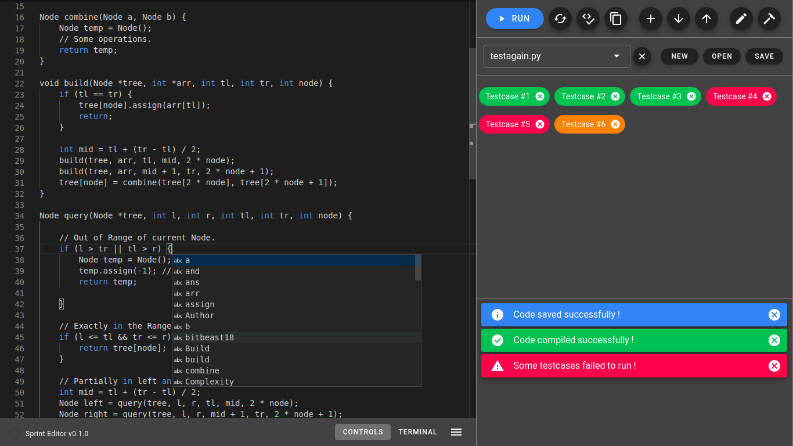

<p align='center'>
  
</p>

<h3 align='center'> Sprint </h3>

<p align='center' markdown='1'>
A tailored code editor for competitive programmers
</p>
<br>



---------------------------------------------------

### Status

[](https://github.com/bitbeast18/sprint/actions/)
[](http://makeapullrequest.com)
[](https://github.com/tterb/atomic-design-ui/blob/master/LICENSEs)

--------------------------------------------------

# Why should you use it?

- Provides single click compilation and execution.
- Simple yet feature-rich design. No need to leave your editor for any task.
- Lots of editing tools inherited from the Monaco Editor.
- A new way of navigating between files. It's called the SELECTOR.
- Automatically detects languages from the file name and adjusts the environment accordingly.
- Optional RERUN button to execute code without comiling again and again.
- Inbuilt terminal support
- Format and Lint code on demand.
- Custom IO mode for experimenting with your code and running single tasks.
- Testcase mode for adding, comparing and running multiple testcases with one click. Options to save and load testcases.
- Colored chips that show your execution result in a single glance.
- Improved notification system to keep track of events and tasks.
- Awesome UI customisations to fit your taste.
- Parse testcases from contest pages with just one click. [Thanks Competitive Companion]

And lots more...

# Installation
You can find the respective executables/binaries in the [release page](https://github.com/bitbeast18/sprint/releases). Check the `Assets` for the required files. Installation guidelines for different operating systems is described below.

### Linux
If you are using some variant of Linux you have two options:

- Install using `snap`, if it supports. First download the `.snap` package from the above mentioned link. Run the command below with `package-name` as the name of downloaded file. You should then have the editor in your applications.

```
$ sudo snap install 'package-name' --dangerous
```

- Use an `AppImage`. Download the `.AppImage` package and make it executable by right-clicking > `properties` > `permissions` > check the `Allow executing file as program` and then you can run by `DBLCLICK` it. You can do the same using command line as follows:

```
$ chmod +x 'appimage-path'
$ ./appimage-path
```

### Windows

If you are on windows you can download the `.exe` setup from the link above and just run it. You may be prompted by Windows Smart Screen saying that its harmful. If so, click on `More info` and a button `Run Anyway` will appear and just proceed.  

### MacOS

If you are on MAC then download the `.dmg` or the `.app` package from the link above. Extract the `dmg` package to `/Applications` or run the `.app` bundle.

### Building from source

If you wish to build the project from source then check the contributing guide for initial setup and just run the `electron:build` npm script. You may need `windows-build-tools` if you are on windows.

-------------------------------------------------

### Intended Workflow

The editor was designed with competitive programmers in mind. It introduces some tools and UI changes to usual editor so that it makes the whole experience simple and less annoying. Most of the annoying tasks are handled for you. The editor was created with the following workflow in mind.

**Make sure you have the required language compiler/interpreter in your `PATH` variable.**

**Make sure the file you open or create has proper extension of supported language.**

1. Create `NEW` or `OPEN` file with the proper file extensions. Currently supports `cpp`, `c`, `python`, `java`.
2. A code editor will open up. Write the code and now you have two options to `run` it.
3. Either use `Custom IO mode`(when you intend to run single task) or switch to `Testcase mode` (if you have multiple testcases to run).
4. After deciding the `mode` you can just click on the `RUN` button, which compiles and runs your code against all the testcases if you are in `testcase mode` and the `chips` will turn to some color depending on the execution status. You can click on the `chips` to view the `diff` or `error` (if any). Alternatively, the `Custom IO` area will get focused and you can type in the inputs and get the output stream.
5. Optionally you have a `RERUN` button that runs the last compiled code.
6. The testcases can be saved to the same directory as the Code file or in a separate directory. Also you can load them from previously saved location. The testcase reader will parse all the `.in` and corresponding `.out` files from the selected directory.
7. So a problem in a contest can be saved as a directory with the corresponding code file and the respective testcases.
8. When you parse a contest or a problem using competitve companion a dialog will appear in the editor asking for a directory to save the file/s. 

```
Contest-name
|---Problem-name-1
    |---codefile.extension
    |---testfile1.in
    |---testfile1.out
```

Any suggestion to above workflow are encouraged. 

--------------------------------------

# Contribution

If you wish to contribute to this repository then follow the steps below to build the project.

Make sure you have `nodejs` and `npm` installed. If you don't, follow the [link](https://nodejs.org/en/). 
Also if you are on windows install some linux terminal client like `git-bash`. The below snippets should work fine
on `linux` and `macOS`. 

* Step 1: Clone the github repository.

```sh
$ git clone https://github.com/bitbeast18/sprint.git
```
* Step 2: Install project dependencies.

```sh
$ cd sprint
$ npm install
```

* Step 3: Re-build `electron` to build native node packages.

```sh 
$ npm install electron-rebuild
$ $(npm bin)/electron-rebuild
```

* Step 4: Run the project.

```sh
$ npm run electron:serve
```

Every time you work on the project make sure to `pull` the updates from `master`.

# Known issues

* If `electron` fails to install then follow the steps below.

```sh
$ cd sprint
$ ELECTRON_MIRROR="https://cdn.npm.taobao.org/dist/electron/" npm install electron@latest --verbose
```

----------------------------------

`pull-requests` are welcomed. If you find any bugs or glitches then please take some time to file an issue. Hope you enjoy the editor:) 
